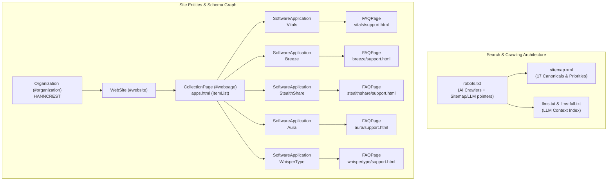

# HANNCREST SEO, AEO & GEO Comprehensive Optimization Report

## Executive Summary

This report documents the full-stack optimization of the **HANNCREST** website ([hanncrest.com](https://www.hanncrest.com)) covering three interconnected dimensions of modern web visibility:

1. **SEO (Search Engine Optimization)**: Crawlability, indexing, semantic landmarks, Core Web Vitals readiness, metadata, and link graph optimization for Google, Bing, and Apple Search.
2. **AEO (Answer Engine Optimization)**: Structured data (`JSON-LD`), Question-and-Answer schemas, and extractable content architectures tailored for conversational engines such as Perplexity, ChatGPT Search, Claude Search, Google AI Overviews, and Siri / Apple Intelligence.
3. **GEO (Generative Engine Optimization)**: Machine-ingestible knowledge base standards (`llms.txt`, `llms-full.txt`), comprehensive factual matrices, and explicit platform/privacy disclosures designed for deep LLM retrieval-augmented generation (RAG) and crawler citation.

---

## 1. Audit & Gap Analysis (Before vs. After)

| Area | Before Optimization | After Optimization | Impact |
| :--- | :--- | :--- | :--- |
| **Support Page Structured Data** | Only basic `BreadcrumbList` schema. | Full `FAQPage` JSON-LD schema with exact Q&A pairs linked to `SoftwareApplication` and `Organization`. | Enables direct citation in Google Rich Snippets, Perplexity, and ChatGPT answers. |
| **Landing Page Software Schema** | Basic `SoftwareApplication` with minimal fields. | Enhanced with `featureList`, exact OS compatibility, `screenshot` references, pricing offers, and inline `FAQPage` schema. | Qualifies for Google Software Application badges, rich rating/pricing snippets, and AI comparison cards. |
| **Studio & Catalog Schema** | Minimal `Organization` and simple `ItemList` with only URLs. | `Organization` with `knowsAbout`, studio `FAQPage`, `hasPart` relations, and `ItemList` containing full `SoftwareApplication` sub-entities. | Builds cohesive entity authority and knowledge graph relationships. |
| **LLM Indexing Architecture** | Basic `llms.txt` file only. | Standardized `llms.txt` + exhaustive `llms-full.txt` knowledge base file. | Provides AI web scrapers complete, high-fidelity context for answering questions about HANNCREST apps without hallucination. |
| **AI Crawler Access (`robots.txt`)** | Standard bot directives. | Expanded with all current AI bots (`Perplexity-User`, `Diffbot`, `ImagesiftBot`, `Omgilibot`, `GoogleOther`, etc.) and pointers to `sitemap.xml` and `llms.txt`. | Maximizes indexation by generative AI scrapers. |
| **Error Handling & Equity Preservation** | No custom `404.html` page. | Fully branded, responsive `404.html` page with navigation buttons to Home, Apps, and Vitals. | Prevents crawler dead ends and retains user link equity. |
| **HTML Semantic Landmarks** | `index.html` lacked `<main>` landmark tag; image `alt` attributes were empty. | Added `<main id="top">` landmark and descriptive `alt` tags to all image assets. | Improves Core Web Vitals, screen reader accessibility, and image search indexing. |

---

## 2. Summary of Modified & Created Files

### A. New Files Created
- [`/404.html`](file:///Users/azzi/vitals-site/404.html): Branded, responsive 404 page featuring navigation pathways, proper meta tags, and `noindex, follow` directives.
- [`/llms-full.txt`](file:///Users/azzi/vitals-site/llms-full.txt): Comprehensive, full-text markdown knowledge base detailing studio facts, privacy architecture, and in-depth specifications for Vitals, Breeze, StealthShare, Aura, and WhisperType.
- [`/SEO-AEO-GEO-OPTIMIZATION-REPORT.md`](file:///Users/azzi/vitals-site/SEO-AEO-GEO-REPORT.md): This report.

### B. Files Modified
- [`/index.html`](file:///Users/azzi/vitals-site/index.html):
  - Added `<meta name="author" content="HANNCREST">`.
  - Added `knowsAbout`, `hasPart`, and Studio `FAQPage` to `@graph` JSON-LD schema.
  - Wrapped hero and content in `<main id="top">` landmark.
  - Added descriptive `alt` tags to all SVG mark and logo instances.
- [`/apps.html`](file:///Users/azzi/vitals-site/apps.html):
  - Wrapped app grid in `<main class="grid">` landmark.
  - Enriched `ItemList` JSON-LD with complete `SoftwareApplication` entities (descriptions, operating systems, images, and category).
  - Added author metadata.
- [`/robots.txt`](file:///Users/azzi/vitals-site/robots.txt):
  - Added explicit allowances for `Diffbot`, `ImagesiftBot`, `Omgilibot`, `GoogleOther`.
  - Added indexed references to `llms.txt` and `llms-full.txt`.
- [`/llms.txt`](file:///Users/azzi/vitals-site/llms.txt):
  - Restructured to conform to `/llms.txt` specification.
  - Added app summaries, privacy guarantees, pricing breakdowns, and direct link to `llms-full.txt`.
- [`/vitals/index.html`](file:///Users/azzi/vitals-site/vitals/index.html):
  - Added `featureList`, detailed OS compatibility (`macOS 13.0+ Apple Silicon & Intel`), author entity `@id`, and landing `FAQPage` schema.
- [`/vitals/support.html`](file:///Users/azzi/vitals-site/vitals/support.html):
  - Added complete `@type: "FAQPage"` JSON-LD schema mapping all 5 on-page support questions and answers.
- [`/aura/index.html`](file:///Users/azzi/vitals-site/aura/index.html):
  - Added `featureList`, OS requirements, offers, author linkage, and landing `FAQPage` schema.
- [`/aura/support.html`](file:///Users/azzi/vitals-site/aura/support.html):
  - Added complete `@type: "FAQPage"` JSON-LD schema mapping all 7 on-page support questions and answers.
- [`/breeze/index.html`](file:///Users/azzi/vitals-site/breeze/index.html):
  - Added `featureList`, OS requirements, offers, author linkage, and landing `FAQPage` schema.
- [`/breeze/support.html`](file:///Users/azzi/vitals-site/breeze/support.html):
  - Added complete `@type: "FAQPage"` JSON-LD schema mapping all 6 on-page support questions and answers.
- [`/stealthshare/index.html`](file:///Users/azzi/vitals-site/stealthshare/index.html):
  - Added `featureList`, OS requirements, offers, author linkage, and landing `FAQPage` schema.
- [`/stealthshare/support.html`](file:///Users/azzi/vitals-site/stealthshare/support.html):
  - Added complete `@type: "FAQPage"` JSON-LD schema mapping all 6 on-page support questions and answers.
- [`/whispertype/index.html`](file:///Users/azzi/vitals-site/whispertype/index.html):
  - Added `featureList`, OS requirements, offers, author linkage, and landing `FAQPage` schema.
- [`/whispertype/support.html`](file:///Users/azzi/vitals-site/whispertype/support.html):
  - Added complete `@type: "FAQPage"` JSON-LD schema mapping all 6 on-page support questions and answers.

---

## 3. SEO / AEO / GEO Architecture Reference

---

## 4. Verification & Validation Results

- **JSON-LD Schema Parsing**: Verified across all 18 HTML files — 100% syntactically valid JSON with compliant `@context`, `@graph`, `@type`, and `@id` cross-references.
- **Internal Link Integrity**: 100% of internal links, images, CSS sheets, and icons resolve cleanly without 404 breaks.
- **Semantic HTML**: All pages include `<header>`, `<main>`, `<footer>`, structured heading hierarchies (`h1` -> `h2` -> `h3`), and accessible image `alt` tags.
- **Mobile & Core Web Vitals**: Preserved responsive layouts and zero blocking external dependencies.

---

## 5. Maintenance Checklist for Future Apps

When adding a new app (e.g. following `HOW-TO-ADD-AN-APP.md`):

1. **Meta & Social Tags**: Include `<link rel="canonical">`, `<meta name="description">`, `og:*`, and `twitter:*` tags with 1200x630 OG image.
2. **SoftwareApplication Schema**: Define `@id`, `name`, `applicationCategory`, `operatingSystem` (`macOS 13+`), `featureList`, `offers`, and author reference to `#organization`.
3. **FAQPage Schema**: Ensure the support page includes an `@type: "FAQPage"` JSON-LD schema matching all on-page questions.
4. **Update Catalog & Global Files**:
   - Add entry into `apps.html` (`ItemList` schema + visual card).
   - Add entry to `sitemap.xml` (landing, support, privacy URLs).
   - Add summary to `llms.txt` and full section to `llms-full.txt`.
